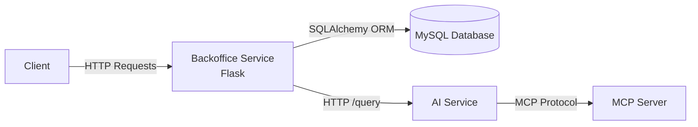

# HBNtory Architecture

## System Overview

HBNtory is composed of multiple independent services communicating through HTTP and dedicated protocols.

The system is designed around a Backoffice service that acts as the main entry point for application operations. Other services provide specialized features such as AI processing and external data access.

The main components are:

* **Backoffice Service**: Main Flask application handling business logic, authentication, resource management and communication with other services.
* **MySQL Database**: Persistent storage for application data.
* **AI Service**: Independent service responsible for AI query processing.
* **MCP Server**: Provides tools and data access capabilities to the AI service.

---

# Initial Service Diagram



## Service Responsibilities

### Backoffice Service

The Backoffice service is the central application service.

Responsibilities:

* Expose HTTP API endpoints.
* Handle authentication and user sessions.
* Validate requests and responses.
* Apply business rules.
* Manage users, branches and stock.
* Communicate with external services such as the AI service.

The Backoffice follows a layered architecture:

```
Route (HTTP)
      |
      v
Service (Business Logic)
      |
      v
Repository (Database Access)
      |
      v
Database
```

---

### AI Service

The AI service is responsible for processing AI-related requests.

Responsibilities:

* Receive AI queries.
* Execute AI processing workflows.
* Use available tools when additional information is required.
* Return generated responses.

The AI service remains independent from the Backoffice business logic.

---

### MCP Server

The MCP server provides external capabilities used by the AI service.

Responsibilities:

* Expose tools through MCP communication.
* Provide access to required external resources.
* Allow the AI service to retrieve additional information.

---

### MySQL Database

The database stores persistent application data.

Stored data includes:

* Users
* Branches
* Stock information

Database access is handled only through the repository layer.

---

# Backoffice Architecture

The Backoffice application is built with Flask using an application factory pattern and blueprints.

Each resource has its own route module.

The business logic is separated into independent layers:

```
route (HTTP)
      |
      v
service (business logic)
      |
      v
repository (ORM access)
      |
      v
database
```

## Routes

Routes are responsible for:

* Receiving HTTP requests.
* Validating input using Pydantic schemas.
* Calling the appropriate service.
* Returning HTTP responses.
* Translating business exceptions into HTTP status codes.

Routes do not contain database logic.

---

## Services

Services contain application business rules.

Responsibilities:

* Validate business constraints.
* Apply application logic.
* Coordinate repository operations.
* Raise business exceptions.

Services do not handle HTTP concerns.

---

## Repositories

Repositories are responsible for database access.

Responsibilities:

* Execute database queries.
* Use SQLAlchemy models.
* Persist and retrieve data.

Repositories are the only layer communicating directly with the ORM.

---

## Utils

Utility modules contain reusable stateless functions.

Examples:

* Password hashing.
* Password verification.
* JWT generation.

Utilities do not access the database or handle HTTP requests.

---

# Data Models

The project separates database models and API schemas.

## SQLAlchemy Models

Used for database persistence.

Examples:

* User model
* Branch model
* Stock model

---

## Pydantic Schemas

Used for API validation and serialization.

Each resource defines separate schemas:

* Create schemas for input validation.
* Update schemas for partial updates.
* Read schemas for API responses.

Sensitive information is never exposed.

Examples:

* Password hashes are never returned.
* Internal database fields are not exposed unnecessarily.

---

# Security Considerations

The architecture includes several security measures:

* Passwords are hashed using Argon2.
* Authentication uses JWT tokens.
* JWT secrets are stored through environment variables.
* Sensitive fields are excluded from API responses.
* Authentication errors use generic messages to prevent user enumeration.

JWT authentication is stateless. A valid token remains usable until expiration unless additional token revocation mechanisms are implemented.

